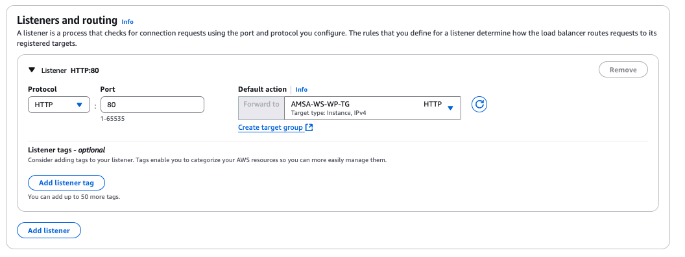
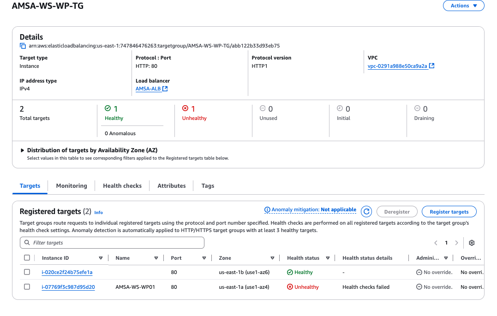
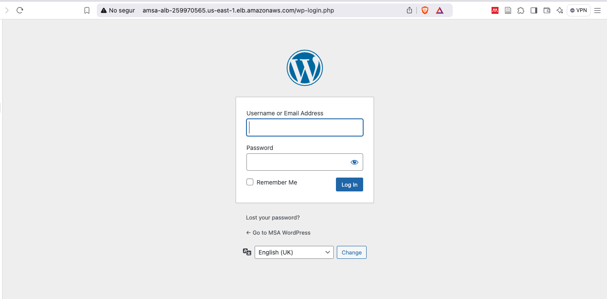

# Creació del Balancejador de Càrrega

En aquest punt, crearem un balancejador de càrrega per a les nostres instàncies EC2. Aquest balancejador de càrrega serà responsable de distribuir uniformement el tràfic entre les instàncies EC2 que allotgen WordPress.

Existeixen 3 tipus de balancejadors de càrrega a AWS: **Application Load Balancer (ALB)**, **Network Load Balancer (NLB)** i **Gateway Load Balancer (GWLB)**. En aquest cas, utilitzarem un **Application Load Balancer (ALB)**, ja que és el recomanat per a aplicacions web que utiltizen HTTP i HTTPS.

Navegueu a la consola de AWS i seleccioneu el servei **EC2**. A la barra lateral, seleccioneu **Load Balancers** i després **Create Load Balancer**.

- **Nom del balancejador de càrrega**: AMSA-ALB
- **Scheme**: Internet-facing
- **IP Address Type**: IPv4


- **VPC**: AMSA-VPC
- **Availability Zones**: Seleccionar les zones de disponibilitat on tenim les subxarxes Front-01 i Front-02.


- **Grups de Seguretat**: Nou grup de seguretat (**AMSA-ALB-SG**), aquest grup de seguretat permetrà el tràfic d'entrada per als ports 80 (HTTP) i 443 (HTTPS) des de qualsevol origen però restringirà el tràfic de sortida a les instàncies EC2 (grup de seguretat **AMSAWebSG**).

    ```yaml
    AMSALBSG:
        Type: AWS::EC2::SecurityGroup
        Properties:
            GroupDescription: Security Group for AMSA ALB
            VpcId: !Ref AMSAVPC
            SecurityGroupIngress:
                - IpProtocol: tcp
                  FromPort: 80
                  ToPort: 80
                  CidrIp: 0.0.0.0/0
                - IpProtocol: tcp
                    FromPort: 443
                    ToPort: 443
                    CidrIp: 0.0.0.0/0
            SecurityGroupEgress:
                - IpProtocol: -1
                  FromPort: -1
                  ToPort: -1
                  DestinationSecurityGroupId: !Ref AMSAWebSG
        Tags:
            - Key: Name
              Value: AMSA-ALB-SG
    ```

    

- **Listeners**: Crearem un listener per al port 80 (HTTP), que redirigirà el tràfic al port 80 de les instàncies EC2. Al port 443 (HTTPS) de moment no configurarem cap redirecció. Per fer-ho, primer haureu de crear un **Target Group**. Aquest grup es necessari per indicar al balancejador de càrrega on enviar el tràfic.

  - *Target Group*:
    - **Target Type**: Instance
    - **Nom**: AMSA-WS-WP-TG
    - **Protocol**: HTTP
    - **Port**: 80
    - **VPC**: AMSA-VPC

    

    - Health Check: Per defecte, el balancejador de càrrega comprova la salut de les instàncies EC2 a través del port 80 i la ruta **/**. Això significa que el balancejador de càrrega enviarà tràfic a les instàncies EC2 que responguin correctament a les peticions HTTP a la ruta **/**. Com que les nostres instàncies EC2 tenen WordPress instal·lat, aquestes instàncies respondran correctament a les peticions HTTP a la ruta **/**. *Podem deixar la configuració per defecte*.

    > Nota: La instal·lació de wordpress retorna 302, per tant, el health check no funcionarà correctament. Per solucionar-ho, temporalment, podem modificar el health check perquè comprovi la resposta 302 en lloc de la 200.

  Finalment, crearem el target group:

  

  ```yaml
    AMSAWSWPTG:
        Type: AWS::ElasticLoadBalancingV2::TargetGroup
        Properties:
            HealthCheckIntervalSeconds: 30
            HealthCheckPath: /
            HealthCheckProtocol: HTTP
            HealthCheckTimeoutSeconds: 5
            HealthyThresholdCount: 2
            Name: AMSA-WS-WP-TG
            Port: 80
            Protocol: HTTP
            TargetType: instance
            UnhealthyThresholdCount: 2
            VpcId: !Ref AMSAVPC
    ```

  - *Registrar targets*: Afegeix les instàncies EC2 al target group. De les dues instàncies EC2 que tenim, seleccionarem les dues. Una instancia es marcarà com a healthy i l'altra com a unhealthy ja que la primera instancia no té wordpress instal·lat (l'hem creat per testar la connexió amb la base de dades RDS). Un cop ho comprovem, la desregistrem i només deixem la instància amb wordpress instal·lat.

      

Un cop creat el target group, el seleccionarem com a target del listener del balancejador de càrrega.



```yaml
AMSAALB:
    Type: AWS::ElasticLoadBalancingV2::LoadBalancer
    Properties:
        Name: AMSA-ALB
        Scheme: internet-facing
        IpAddressType: ipv4
        SecurityGroups:
            - !Ref AMSALBSG
        Subnets:
            - !Ref AMSAFront01
            - !Ref AMSAFront02
        Tags:
            - Key: Name
              Value: AMSA-ALB
    DependsOn: AMSAWSWPTG
```

Abans de crear el balancejador de càrrega, assegureu-vos de tenir un resum amb totes les configuracions necessàries:


Un cop creat el balancejador de càrrega, heu d'esperar uns minuts fins que el seu estat passi de **Provisioning** a **Active**. Un cop l'estat sigui **Active**, podeu accedir al balancejador de càrrega a través de la seva adreça DNS.


Un cop l'estat del balancejador de càrrega sigui **Active**, veure que tenim una target group amb una instància healthy i una unhealthy. Això és degut a que una de les instàncies EC2 no té WordPress instal·lat. Per solucionar-ho, desregistreu la instància unhealthy i només deixeu la instància healthy.



Ara ja podem accedir al balancejador de càrrega a través de la seva adreça DNS i veure la pàgina d'instal·lació de WordPress:


Procedirem a instal·lar WordPress a través del balancejador de càrrega. Podem definir el nom del lloc, l'usuari i la contrasenya de l'administrador, i la nostra adreça de correu electrònic:

- **Site Title**: AMSA WordPress
- **Username**: amsa-wp-admin
- **Password**: smveMMyD79@%4OauH3
- **Your Email**: amsa-wp-admin@gmail.com


Un cop instal·lat WordPress, haureu de veure la pàgina d'inici de WordPress:



Ara ja teniu el servidor web configurat amb WordPress i el balancejador de càrrega per distribuir el tràfic entre les instàncies EC2. Recordeu de modificar el health check del target group perquè comprovi la resposta del 200 en lloc de la 302. Haureu de deregistrar i tornar a registrar les instàncies EC2 perquè el health check es torni a comprovar.

Ara podeu utilitzar curl o recarregar la pàgina web per veure com el balancejador de càrrega distribueix el tràfic entre les instàncies EC2.

```bash
curl http://AMSA-ALB-XXXXXXX.us-west-2.elb.amazonaws.com
```

Per observar-ho podeu accedir als logs de les instàncies EC2 i veure com el tràfic es distribueix entre les dues instàncies.

```bash
sudo tail -f /var/log/httpd/access_log
```
