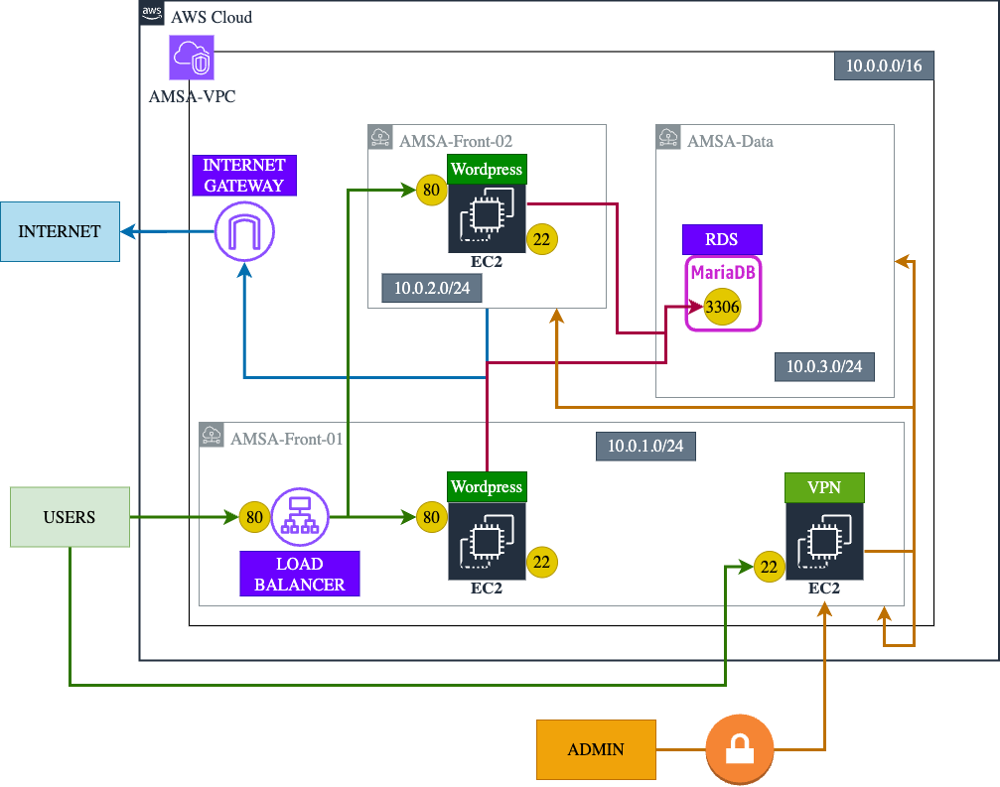

# Arquitectura Escalable per a WordPress

En aquesta pràctica, dissenyarem i implementarem una arquitectura escalable i segura per a una aplicació WordPress, utilitzant els serveis d’AWS. Aquesta arquitectura constarà dels següents components:

- **Balancejador de Càrrega (Load Balancer)**: Serà responsable de distribuir uniformement el tràfic entrant entre múltiples instàncies EC2. Això assegura una alta disponibilitat i resiliència davant augments de càrrega.

- **Instàncies EC2**: Aquestes màquines virtuals allotjaran l’aplicació WordPress. Estaran dins d’un grup d’autoscaling, que permetrà ajustar dinàmicament el nombre d’instàncies en funció de la demanda.

- **Base de Dades RDS**: Utilitzarem Amazon RDS per gestionar la base de dades de WordPress.

## Tasques

1. [Creació de la VPC i les subxarxes](./vpc-networking.md)
2. [Taules d'Enrutament i Associacions](./routing.md)
3. [Grups de Seguretat](./security.md)
4. [Creació de la Base de Dades RDS](./rds.md)
5. [Creació de l'instància EC2](./ec2.md)
6. [Wordpress](./wordpress.md)
7. [Balancejador de Càrrega](./loadbalancer.md)
8. [Configuració VPN](./vpn.md)

## Cloud Formation

Us he preparat diferents fitxers de plantilles de CloudFormation per a desplegar diferents versions de la infraestructura.

1. Versió 1: En aquesta versió es desplegarà la VPC, les subxarxes, els grups de seguretat, la base de dades RDS i les instàncies EC2. No s'instal·larà WordPress. A més a més, es crearan les taules d'enrutament i les associacions necessàries. Podeu trobar el fitxer de plantilla a [infra_v1.yaml](../src/wordpress/infra_v1.yaml).

20h a 150euros/h = 150*20 = 3000euros

15% pel Didac = 500euros
15% pel Jordi = 500euros
70% per mi = 2000euros