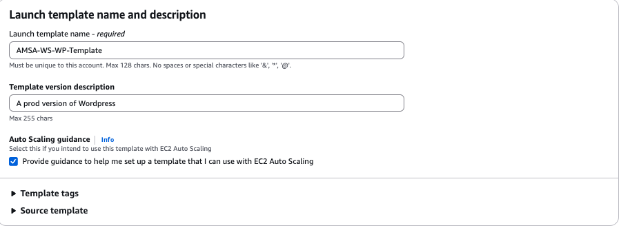

# Configuració del Servidor Web amb WordPress

En aquest punt, volem crear un servidor web amb WordPress. Per fer-ho, instal·larem el servidor web Apache, el llenguatge de programació PHP. A continuació, descarregarem i configurarem WordPress per a la nostra aplicació. Aquests passos ja els vam realitzar en la pràctica anterior de forma manual. Ara, els automatitzarem creant una plantilla que ens permeti desplegar instàncies EC2 amb WordPress ja configurat i preparades per connectar amb la nostra base de dades RDS.

```bash
#!/bin/bash
# sudo bash install_wp.sh

# Ajusteu les dades següents segons les vostres dades
DB_NAME="wordpress"
DB_USER="amsa-wordpress-user"
DB_ROOT_USER="admin"
DB_USER_PASSWORD="h0dc-w0rdpr3ss-p4ssw0rd"
DB_ROOT_PASSWORD="h0dc?r00t?p4ssw0rd"
DB_HOST="amsa-db.cztwlalq0ipf.us-east-1.rds.amazonaws.com" 

if [ "$(id -u)" -ne 0 ]; then
    echo "Please run this script with sudo or as root."
    exit 1
fi

dnf install -y wget php-mysqlnd httpd php-fpm php-mysqli php-json php php-devel php-gd expect

cd /tmp
wget https://wordpress.org/latest.tar.gz
tar -xzf latest.tar.gz

# Configure WordPress
cp wordpress/wp-config-sample.php wordpress/wp-config.php
sed -i "s/database_name_here/$DB_NAME/g" wordpress/wp-config.php
sed -i "s/username_here/$DB_USER/g" wordpress/wp-config.php
sed -i "s/password_here/$DB_USER_PASSWORD/g" wordpress/wp-config.php
sed -i "s/localhost/$DB_HOST/g" wordpress/wp-config.php

sudo cp -r wordpress/* /var/www/html/

sudo sed -i 's/AllowOverride None/AllowOverride All/g' /etc/httpd/conf/httpd.conf

sudo chown -R apache:apache /var/www
sudo chmod 2775 /var/www

sudo systemctl restart httpd
```

Aquest script ens permetrà instal·lar i configurar un servidor web amb WordPress a les nostres instàncies EC2. Aneu a **Launch Templates** i creeu una nova plantilla amb la configuració de la instància EC2 i el script anterior.

- **Nom de la plantilla**: AMSA-WS-WP-Template
- **Auto Scaling Guidance**: Yes



- **AMI**: Amazon Linux 2023 (64-bit x86)


- **Tipus d'instància**: t2.micro
- **Key Pair**: AMSA-KEY


- **Subxarxa**: No seleccionar cap subxarxa (es seleccionarà dinàmicament)
- **Grup de Seguretat**: AMSAWebSG


Aneu a la secció de **Advanced Details** i afegiu el script anterior a la secció de UserData.


```yaml
AMSAWebServerTemplate:
    Type: AWS::EC2::LaunchTemplate
    Properties:
        LaunchTemplateName: AMSA-WS-WP-Template
        LaunchTemplateData:
            ImageId: ami-0c55b159cbfafe1f0
            InstanceType: t2.micro
            KeyName: AMSA-KEY
            SecurityGroupIds:
                - !Ref AMSAWebSG
            UserData:
                Fn::Base64: !Sub |
                    #!/bin/bash
                    # sudo bash install_wp.sh
                    dnf install -y wget php-mysqlnd httpd php-fpm php-mysqli php-json php php-devel php-gd expect
                    cd /tmp
                    wget https://wordpress.org/latest.tar.gz
                    tar -xzf latest.tar.gz
                    cp wordpress/wp-config-sample.php wordpress/wp-config.php
                    sed -i "s/database_name_here/wordpress/g" wordpress/wp-config.php
                    sed -i "s/username_here/amsa-wordpress-user/g" wordpress/wp-config.php
                    sed -i "s/password_here/h0dc-w0rdpr3ss-p4ssw0rd/g" wordpress/wp-config.php
                    sed -i "s/localhost/amsa-db.cztwlalq0ipf.us-east-1.rds.amazonaws.com/g" wordpress/wp-config.php
                    cp -r wordpress/* /var/www/html/
                    sed -i 's/AllowOverride None/AllowOverride All/g' /etc/httpd/conf/httpd.conf
                    chown -R apache:apache /var/www
                    chmod 2775 /var/www
                    systemctl restart httpd
```

Un cop creada la plantilla de llançament, podeu utilitzar-la per crear instàncies EC2 amb WordPress ja configurat i preparades per connectar amb la vostra base de dades RDS.


Aneu a la secció **EC2** de la consola d'AWS i seleccioneu **Launch Instance**.


A continuació, seleccioneu la plantilla de llançament **AMSA-WS-WP-Template** i configureu la resta de paràmetres segons les vostres necessitats (seleccioneu la subxarxa **Front-02** per a aquest exemple). A més a més, seleccioneu que s'assigni una IP pública a la instància.

Un cop creada la instància:


Observeu que la instància EC2 s'ha creat sense nom assignat. Això és degut a que el nom de la instància no l'hem definit.

Si tot ha anat bé, hauríeu de poder accedir a la instància EC2 a través del navegador web i veure la pàgina d'instal·lació de WordPress:


> **Nota**: No realitzarem la instal·lació de WordPress en aquest punt, ja que primer configurarem el balancejador de càrrega. Quan s'instal·la wordpress guarda i configurar la ip de la instància, per tant, si després es vol posar un balancejador de càrrega, no funcionarà correctament i haurem de reconfigurar wordpress. Per tant, primer configurarem el balancejador de càrrega i després instal·larem wordpress per tal de que quan s'instal·li, es guardi la ip del balancejador de càrrega que és la que es mantindrà constant.
